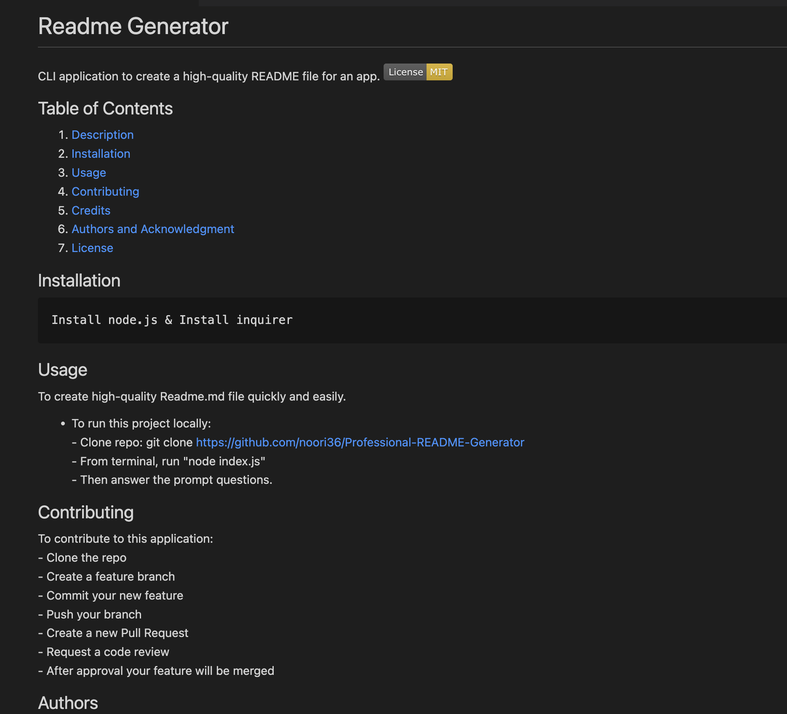

# Professional Readme Generator

  CLI application to create a high-quality readme file.
  
 ## User Story
```
AS A developer
I WANT a README generator
SO THAT I can quickly create a professional README for a new project
```

 
  ## Table of Contents

  1. [Installation](#installation)
  1. [Usage](#usgae)
  3. [Contributing](#contributing)
  4. [Authors](#authors%20and%20acknowledgment)
  5. [License](#license)


  ## Installation:
  ```
  1- Install node.js  
  2- Install inquirer
  3- git clone URL OF THE REPO
  4- From terminal run “node index.js”
  ``` 


  ## Usage
  Create a professional readme.md file easily and quickly.
  
  - Screenshot
  <br>

  
  - <br><a href="https://drive.google.com/file/d/1frPcKCF6me5XFSVb4NPXX92wk84tJtm-/view?usp=sharing"> Walkthrouh Video</a>
    
  - <a href="./ReadmeGenerator.md">Sample README.md File Generated</a>
  -   [The URL of the GitHub Repository.](https://github.com/noori36/Professional-README-Generator)
 

  ## Contributing:
  To contribute to this application:
  ```
  - Clone the repo 
  - Create a feature branch 
  - Commit your new feature 
  - Push your branch 
  - Create a new Pull Request 
  - Request a code review 
  - After approval your feature will be merged
  ```
  
  ## Authors

  Noreen A
  

## License

[MIT](https://choosealicense.com/licenses/mit/)
    
