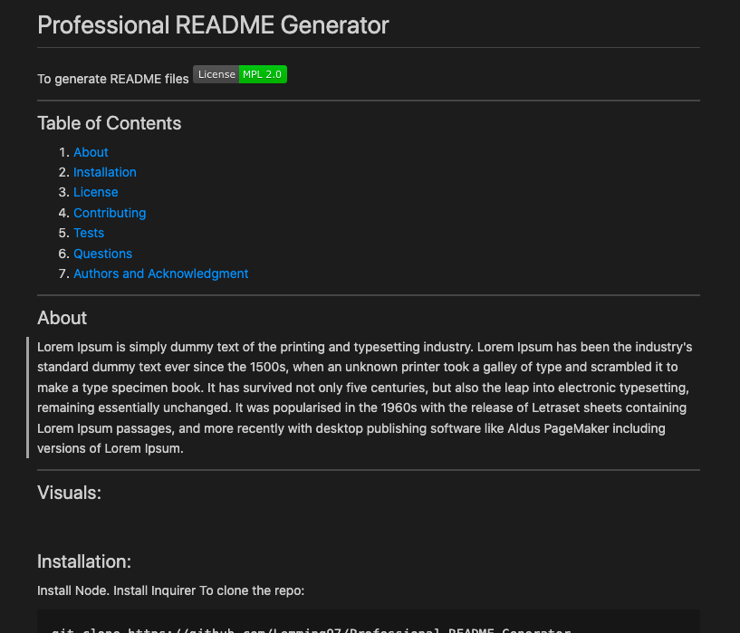

# Professional README Generator


## Title

README Generator

## Table of Contents 

- [User Story](#user-story)
- [Acceptance Criteria](#acceptance-criteria)
- [Installation](#installation)
- [Usage](#usage)
- [Video](#video)
- [Screenshots](#screenshots)


## User Story
```
AS A developer
I WANT a README generator
SO THAT I can quickly create a professional README for a new project
```

## Acceptance Criteria
```
GIVEN a command-line application that accepts user input
WHEN a user is prompted for information about their application repository
THEN a high-quality, professional README.md is generated with the title of their project and sections entitled Description, Table of Contents, Installation, Usage, License, Contributing, Tests, and Questions.

WHEN a user enter their project title
THEN this is displayed as the title of the README.

WHEN a user enter a description, installation instructions, usage information, contribution guidelines, and test instructions
THEN this information is added to the sections of the README entitled Description, Installation, Usage, Contributing, and Tests.

WHEN a user chooses a license for their application from a list of options
THEN a badge for that license is added near the top of the README and a notice is added to the section of the README entitled License that explains which license the application is covered under.

WHEN a user enters their GitHub username
THEN this is added to the section of the README entitled Questions, with a link to my GitHub profile.

WHEN a user enters their email address
THEN this is added to the section of the README entitled Questions, with instructions on how to reach them with additional questions.

WHEN a user clicks on the links in the Table of Contents
THEN a user is taken to the corresponding section of the README.
```


## Installation

Install node.js, then install inquirer

## Usage

Generating Professional README.md files 


## Video


<p>To View the Video: <a href="https://drive.google.com/file/d/1z143MG2gltlaBp-d7DmlggEckM6AAdLm/preview"> Click Here</a></p>


## Screenshots

<br>

<p>To view the sample README.md file generated, <a href="./samplereadme.json.md">Click Here</a></p>


# Professional Readme Generator

  CLI application to create a high-quality readme file.
  [](https://opensource.org/licenses/Apache-2.0)

 
  ## Table of Contents

  1. [Description](#description)
  2. [Installation](#installation)
  3. [Usage](#usgae)
  3. [Contributing](#contributing)
  4. [Credits](#credits)
  4. [Authors and Acknowledgment](#authors%20and%20acknowledgment)
  5. [License](#license)


  ## Installation:
  '''
    ‘’’ <br>1- Install node.js  <br> 2- Install inquirer  <br> 3- git clone URL OF THE REPO  <br> 4- From terminal run “node index.js”  <br>,,,
  '''


  ## Usage
  Create a professional readme.md file easily and quickly.

  The URL of the GitHub repository. https://github.com/noori36/Professional-README-Generator
  <br>
 

  ## Contributing:
  ‘’’<br>To contribute to this application:<br> - Clone the repo <br> - Create a feature branch <br> - Commit your new feature <br> - Push your branch <br> - Create a new Pull Request <br> - Request a code review <br> - After approval your feature will be merged

  
  ## Authors

  Noreen
  * GitHub Profile: (https://github.com/noori36)
  * GitHub Email: (mailto:ladybird229@msnl.com)
  

  ---

  ##License

  
    ## License

    License used for this project - Apache
    ---
